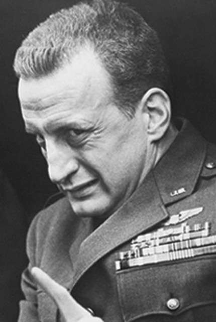

Examples
--------

(Image source: https://www.imdb.com/title/tt0057012/mediaviewer/rm1399751680[IMDB.com])

at_fire_events.pl
-----------------

Can be used to fire action_trigger events from standard input.  It can
be used in a pipeline.

link:examples/at_fire_events.pl[]

checkin.pl
----------

A simple program to demonstrate AppUtils' simplereq and Cronscript's
arguments.  How to checkin copies by barcode and how to pass
authentication parameters via the command line.

link:examples/checkin.pl[]

cstoreeditor_copy_status.pl
---------------------------

Examples of using CStoreEditor and Fielmapper with copy statuses.

link:examples/cstoreeditor_copy_status.pl[]

evergreen-skeletons.el
----------------------

A library of Emacs Skeletons that are useful in Evergreen development
and writing maintenance scripts.

link:examples/evergreen-skeletons.el[]

forgive_bills.pl
----------------

A not so simple program to demonstrate AppUtils' simplereq and
Cronscript's arguments.  How to apply payments by patron barcode and
how to pass authentication parameters via the command line.

link:examples/forgive_bills.pl[]

purge_pending_users.pl
----------------------

This is a Perl example of the srfsh script of the same
name/functionality.  This script will purge pending users from the
staging tables.

link:examples/purge_pending_users.pl[]

realia_fix.pl
-------------

This program was written to fix some MARC records that should have had
a MARC type of r, but didn't.  It also adds a hold matrix matchpoint
entry to block holds on these types of items consortium-wide.  It was
originally written for MVLC and has some hard-coded stat cat entry
ids.  It is an example of a more complex program that does multiple
things and manipulates MARC.

link:examples/realia_fix.pl[]
