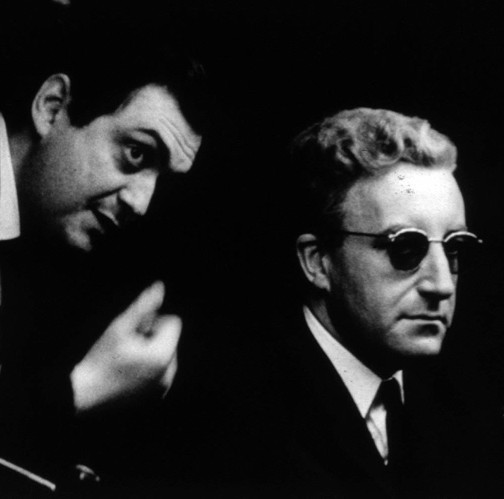

Who, Me?
--------

Who am I?

[role="incremental"]
* ILS Manager for CW MARS, INC.
* Evergreen Core Committer/Contributor
* Contract Programmer
* Fan of Stanley Kubrick and  Peter Sellers
+

+
(Image Source: https://m.media-amazon.com/images/M/MV5BYzIxNThmOTctNzdhNy00YjYwLWE4ZjctMGNhYTZjNTc5YjliXkEyXkFqcGdeQXVyODA1MDc5NjQ@._V1_SY1000_CR0,0,1394,1000_AL_.jpg[IMDB.com/Amazon.com])

Yes, You!
---------

Who are you?

[role="incremental"]
- Advanced, i.e. curious, User
- Who uses GNU/Linux command line?
- Who knows any Perl?
- Who knows any SQL?

What?
-----

What you're going to learn.

[role="incremental"]
- OpenSRF
- Evergreen
- srfsh
- Perl

