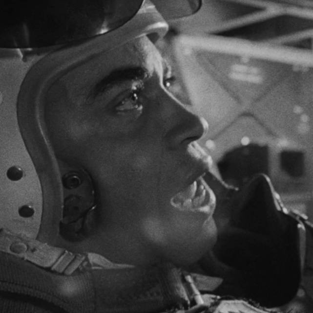

Miscellanea
-----------

(Image source: https://www.imdb.com/name/nm0000469/mediaviewer/rm423245568[IMDB.com])

OpenILS::Const
--------------

[source,perl]
.Using OpenILS::Const
----
use OpenILS::Utils::Cronscript;
use OpenILS::Const;
# Search for checked out copies
my $script = OpenILS::Utils::Cronscript->new({nolockfile=>1});
my $editor = $script->editor();
my $copies = $editor->search_asset_copy({status => OILS_COPY_STATUS_CHECKED_OUT});
----

Constants for Various Data Values
---------------------------------

* Copy Statuses
* Precat Values
** Fine Level
** Loan Duration
** Call Number
** Bibliographic Record ID
* Circulation Duration
* Fine Levels
* Stop Fines
* Hold Types
* Billing Types
* Selected Organizational Unit Settings
* A Few Patron Penalties

OpenILS::Utils::TestUtil
------------------------

Used for writing Perl tests.

Inherits from Cronscript, so it has all of the same features, plus a
few extra niceties that are useful for testing:

* find_workstation
* register_workstation
* find_or_register_workstation
* do_checkout
* do_checkin
* do_checkin_override

You can use it in place of Cronscript in your scripts, if you prefer.

